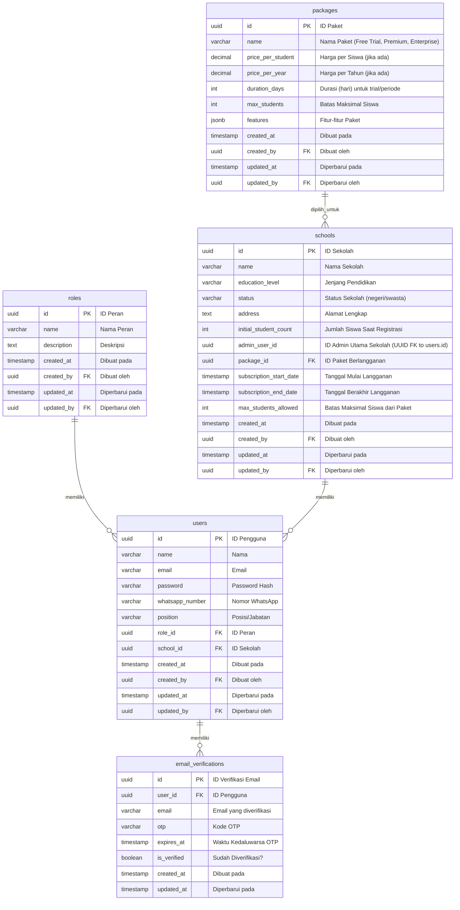

# Barniee Auth Service

[](https://www.google.com/search?q=https://pkg.go.dev/auth-barniee)
[](https://opensource.org/licenses/Apache-2.0)
[](https://www.google.com/search?q=http://localhost:8080/swagger/index.html)

Auth Barniee Service adalah layanan backend berbasis Go (Golang) menggunakan framework Gin dan PostgreSQL sebagai database. Layanan ini bertanggung jawab atas semua operasi yang terkait dengan autentikasi pengguna, otorisasi, manajemen pengguna (oleh admin), dan alur registrasi sekolah multi-tahap, termasuk verifikasi email menggunakan OTP.

## Daftar Isi

* [Arsitektur](https://www.google.com/search?q=%23arsitektur)
* [Fitur](https://www.google.com/search?q=%23fitur)
* [Database Schema](https://www.google.com/search?q=%23database-schema)
* [Prasyarat](https://www.google.com/search?q=%23prasyarat)
* [Setup Lingkungan](https://www.google.com/search?q=%23setup-lingkungan)
    * [Kloning Repositori](https://www.google.com/search?q=%23kloning-repositori)
    * [Konfigurasi Lingkungan (.env)](https://www.google.com/search?q=%23konfigurasi-lingkungan-env)
    * [Penyiapan PostgreSQL](https://www.google.com/search?q=%23penyiapan-postgresql)
    * [Penyiapan Akun Email SMTP (untuk OTP)](https://www.google.com/search?q=%23penyiapan-akun-email-smtp-untuk-otp)
    * [Instalasi Dependensi Go](https://www.google.com/search?q=%23instalasi-dependensi-go)
* [Menjalankan Aplikasi](https://www.google.com/search?q=%23menjalankan-aplikasi)
* [Dokumentasi API (Swagger)](https://www.google.com/search?q=%23dokumentasi-api-swagger)
    * [Menghasilkan Docs](https://www.google.com/search?q=%23menghasilkan-docs)
    * [Mengakses Swagger UI](https://www.google.com/search?q=%23mengakses-swagger-ui)
* [Pengujian API (menggunakan Postman/Insomnia)](https://www.google.com/search?q=%23pengujian-api-menggunakan-postmaninsomnia)
    * [Alur Registrasi Sekolah](https://www.google.com/search?q=%23alur-registrasi-sekolah-public-endpoints)
    * [Autentikasi dan Manajemen Pengguna](https://www.google.com/search?q=%23autentikasi-dan-manajemen-pengguna-authenticated-endpoints)
* [Struktur Proyek](https://www.google.com/search?q=%23struktur-proyek)
* [Kontribusi](https://www.google.com/search?q=%23kontribusi)
* [Lisensi](https://www.google.com/search?q=%23lisensi)

## Arsitektur

Auth Barniee Service dirancang sebagai layanan mandiri (microservice) yang berfokus pada domain autentikasi dan manajemen akses. Ia berinteraksi dengan PostgreSQL sebagai sumber data utama. Komunikasi antar layanan (misalnya dengan `school-management` service di masa mendatang) akan dilakukan melalui REST API.

**Prinsip Desain:**

* **Clean Architecture:** Pemisahan yang jelas antara lapisan domain, service, repository, dan handler.
* **SOLID Principles:** Memastikan kode mudah dipelihara dan diperluas.
* **Layered Architecture:**
    * **`handlers`**: Menangani permintaan HTTP masuk, validasi dasar input, dan memanggil lapisan layanan.
    * **`services`**: Berisi logika bisnis inti, mengorkestrasi operasi repositori, dan menerapkan aturan domain.
    * **`repositories`**: Menyediakan abstraksi untuk interaksi database menggunakan GORM.
    * **`models`**: Definisi struktur data (entitas) yang memetakan ke tabel database.
    * **`utils`**: Berisi fungsi-fungsi pembantu umum (JWT, hashing password, OTP, email).
* **Database:** PostgreSQL dengan GORM sebagai ORM.

## Fitur

Service ini menyediakan fungsionalitas berikut:

* **Autentikasi Pengguna (PBI-001)**
    * Login dengan email dan password.
    * Logout (penghapusan token sisi klien).
* **Manajemen Profil (PBI-006)**
    * Melihat detail profil pengguna yang terautentikasi (Admin, Guru, Siswa).
* **Manajemen Akun oleh Admin (PBI-002)**
    * Membuat akun Guru dan Siswa.
    * Melihat daftar semua akun pengguna (dengan opsi filter peran).
    * Melihat detail akun pengguna berdasarkan ID.
    * Memperbarui detail akun pengguna.
    * Menghapus akun pengguna.
* **Alur Registrasi Sekolah Multi-tahap**
    * **Langkah 1: Data Sekolah:** Mendaftarkan informasi dasar sekolah.
    * **Langkah 2: Data Admin:** Mendaftarkan akun admin utama untuk sekolah baru (password di-generate otomatis).
    * **Langkah 3: Pilih Paket:** Memungkinkan pemilihan paket berlangganan (Free Trial, Premium, Enterprise).
    * **Langkah 4: Verifikasi Email (OTP):** Mengirim dan memverifikasi kode OTP ke email admin sekolah.
    * **Langkah 5: Pembayaran:** (Fungsionalitas ini ada di frontend; backend hanya menunggu konfirmasi jika paket berbayar).
    * **Langkah 6: Selesai:** Finalisasi proses registrasi sekolah.
* **Manajemen Peran:** Mendukung peran `admin`, `teacher`, dan `student`.

## Database Schema

Berikut adalah representasi ER Diagram untuk tabel-tabel yang digunakan oleh `auth-barniee` service:



## Prasyarat

Sebelum menjalankan `auth-barniee` service, pastikan Anda memiliki perangkat lunak berikut terinstal di sistem Anda:

* **Go (Golang):** Versi 1.22 atau yang lebih baru.
* **PostgreSQL:** Versi 12 atau yang lebih baru.
* **Git:** Untuk kloning repositori.
* **Aplikasi Pengujian API:** Postman, Insomnia, atau cURL.

## Setup Lingkungan

Ikuti langkah-langkah di bawah ini untuk mengatur lingkungan pengembangan Anda.

### Kloning Repositori

Buka terminal Anda dan kloning repositori:

```bash
git clone https://github.com/your-username/auth-barniee.git
cd auth-barniee
```

*(Catatan: Ganti `https://github.com/akmalgomal3/auth-barniee.git` dengan URL repositori aktual Anda)*

### Konfigurasi Lingkungan (.env)

Buat file bernama `.env` di root direktori `auth-barniee/`. File ini akan menyimpan variabel lingkungan yang sensitif seperti kredensial database dan kunci JWT. Anda bisa menyalin dari `.env.example` yang disediakan.

```env
DB_HOST=localhost
DB_PORT=5432
DB_USER=postgres
DB_PASSWORD=your_postgres_password
DB_NAME=barniee_auth_db
JWT_SECRET=your_jwt_secret_key
SMTP_HOST=smtp.gmail.com
SMTP_PORT=587
SMTP_USERNAME=your_email@gmail.com
SMTP_PASSWORD=your_email_app_password
SENDER_EMAIL=your_email@gmail.com
OTP_EXPIRY_MINUTES=10
```

**Penting:**

* Ganti `your_postgres_password` dengan password user PostgreSQL Anda.
* Ganti `your_jwt_secret_key` dengan string rahasia yang kuat dan unik (minimal 32 karakter direkomendasikan). **Kunci ini harus sama jika Anda memiliki `school-management` service yang juga memvalidasi token JWT ini.**
* Untuk konfigurasi email SMTP, jika Anda menggunakan Gmail, Anda perlu membuat **App password** karena login dengan password akun biasa mungkin tidak berfungsi. Cari di Google "Gmail app password" untuk instruksinya. `SMTP_USERNAME` dan `SENDER_EMAIL` harus sama dengan email Anda. `SMTP_PASSWORD` adalah app password yang Anda buat.

### Penyiapan PostgreSQL

1.  **Buat Database:**
    Buka klien PostgreSQL Anda (misalnya `psql` atau PgAdmin) dan buat database baru:
    ```sql
    CREATE DATABASE barniee_auth_db;
    ```
2.  **Pastikan Hak Akses:**
    Pastikan user PostgreSQL yang Anda gunakan (`DB_USER` di `.env`) memiliki hak akses yang cukup untuk membuat tabel di database `barniee_auth_db`.

### Penyiapan Akun Email SMTP (untuk OTP)

Fungsi verifikasi email memerlukan server SMTP untuk mengirim OTP. Konfigurasi SMTP Anda ada di file `.env`. Pastikan detailnya benar.

### Instalasi Dependensi Go

Dari root direktori `auth-barniee/`, jalankan perintah berikut untuk mengunduh semua dependensi yang diperlukan:

```bash
go mod tidy
```

## Menjalankan Aplikasi

Setelah semua prasyarat dan setup lingkungan selesai, Anda dapat menjalankan aplikasi:

1.  **Generate Docs Swagger:**
    Sebelum menjalankan aplikasi, generate atau regenerasi dokumentasi Swagger (ini akan ditarik oleh aplikasi saat startup).
    Dari root direktori proyek:

    ```bash
    swag init -g ./cmd/main.go -o cmd/docs
    ```

2.  **Jalankan Aplikasi:**
    Dari root direktori proyek:

    ```bash
    go run cmd/main.go
    ```

    Aplikasi akan mulai berjalan dan mendengarkan permintaan di port `8080`. Output log di terminal akan menunjukkan status aplikasi dan migrasi database yang berhasil.

    *Pada saat pertama kali dijalankan, aplikasi akan secara otomatis melakukan migrasi database (membuat tabel `roles`, `users`, `schools`, `packages`, `email_verifications`) dan melakukan seeding data awal seperti peran (`admin`, `teacher`, `student`) dan paket (`Free Trial`, `Premium`, `Enterprise`). Ini juga akan membuat user **master admin default** dengan email `masteradmin@barniee.com` dan password `masteradminpassword`.*

## Dokumentasi API (Swagger)

Auth Barniee Service dilengkapi dengan dokumentasi API interaktif menggunakan Swagger UI.

### Menghasilkan Docs

Untuk meregenerasi file dokumentasi Swagger setelah ada perubahan pada anotasi handler:

Dari root direktori proyek:

```bash
swag init -g ./cmd/main.go -o cmd/docs
```

### Mengakses Swagger UI

Setelah aplikasi berjalan, buka browser Anda dan navigasikan ke:

```
http://localhost:8080/swagger/index.html
```

Anda akan melihat antarmuka Swagger UI yang menampilkan semua endpoint API yang tersedia, lengkap dengan deskripsi, parameter, dan contoh respons. Anda juga bisa mencoba request langsung dari UI ini.

## Pengujian API (menggunakan Postman/Insomnia)

Anda dapat menguji semua endpoint menggunakan Postman, Insomnia, atau alat pengujian API lainnya. Berikut adalah alur pengujian utama.

**Base URL:** `http://localhost:8080/api/v1`

### Alur Registrasi Sekolah (Public Endpoints)

Ini adalah alur multi-tahap untuk mendaftarkan sekolah baru dan admin utamanya.

1.  **Register School Info (Langkah 1/6)**

    * `POST /register/school-info`
    * **Body (JSON):**
      ```json
      {
          "name": "Sekolah Contoh Aja",
          "education_level": "SD",
          "status": "Negeri",
          "address": "Jl. Fantasi No. 123, Kota Imajinasi",
          "initial_student_count": 80
      }
      ```
    * **Catatan:** Ambil `school_id` dari respons sukses.

2.  **Register Admin Info (Langkah 2/6)**

    * `POST /register/admin-info`
    * **Body (JSON):**
      ```json
      {
          "school_id": "<school_id_dari_langkah_1>",
          "admin_name": "John Doe",
          "admin_email": "john.doe.admin@example.com",
          "whatsapp_number": "081234567890",
          "position": "Kepala Sekolah"
      }
      ```
    * **Catatan:** Ambil `user_id` (untuk admin baru) dan `password` yang di-generate dari respons. Gunakan email yang **bisa Anda akses** untuk menerima OTP.

3.  **Get All Packages (Helper untuk Langkah 3/6)**

    * `GET /register/packages`
    * **Body:** (Tidak ada)
    * **Catatan:** Pilih `id` dari paket yang Anda inginkan dari respons.

4.  **Select Package (Langkah 3/6)**

    * `POST /register/select-package`
    * **Body (JSON):**
      ```json
      {
          "school_id": "<school_id_dari_langkah_1>",
          "package_id": "<id_paket_yang_dipilih_dari_langkah_3>"
      }
      ```

5.  **Request Email Verification OTP (Langkah 4/6 - Request)**

    * `POST /register/email-verification/request-otp`
    * **Body (JSON):**
      ```json
      {
          "user_id": "<admin_user_id_dari_langkah_2>"
      }
      ```
    * **Catatan:** Cek email admin (`john.doe.admin@example.com`) untuk mendapatkan kode OTP.

6.  **Verify Email OTP (Langkah 4/6 - Verify)**

    * `POST /register/email-verification/verify-otp`
    * **Body (JSON):**
      ```json
      {
          "user_id": "<admin_user_id_dari_langkah_2>",
          "otp": "KODE_OTP_DARI_EMAIL"
      }
      ```

7.  **Complete Registration (Langkah 6/6)**

    * `POST /register/complete`
    * **Body (JSON):**
      ```json
      {
          "school_id": "<school_id_dari_langkah_1>"
      }
      ```

### Autentikasi dan Manajemen Pengguna (Authenticated Endpoints)

Setelah registrasi sekolah selesai, admin sekolah dapat login dan mengelola pengguna lainnya.

1.  **Login Pengguna (PBI-001)**

    * `POST /auth/login`
    * **Body (JSON):**
        * Untuk Admin Sekolah:
          ```json
          {
              "email": "<admin_email_dari_langkah_2_registrasi>",
              "password": "<password_generated_dari_langkah_2_registrasi>"
          }
          ```
        * Untuk Master Admin Sistem:
          ```json
          {
              "email": "masteradmin@barniee.com",
              "password": "masteradminpassword"
          }
          ```
    * **Catatan:** Ambil `token` dari respons sukses. Ini adalah JWT Token yang akan digunakan di header `Authorization` untuk semua request terautentikasi selanjutnya (`Authorization: Bearer <TOKEN>`).

2.  **Get User Profile (PBI-006)**

    * `GET /profile`
    * **Headers:** `Authorization: Bearer <JWT_TOKEN>`

3.  **Create Teacher or Student (PBI-002)**

    * `POST /admin/users`
    * **Headers:** `Authorization: Bearer <ADMIN_JWT_TOKEN>`
    * **Body (JSON):**
      ```json
      {
          "name": "Guru Budi",
          "email": "budi.guru@sekolahku.com",
          "password": "gurupassword123",
          "role_name": "teacher"
      }
      ```
      Atau untuk Siswa:
      ```json
      {
          "name": "Siswa Caca",
          "email": "caca.siswa@sekolahku.com",
          "password": "siswapassword123",
          "role_name": "student"
      }
      ```
    * **Catatan:** `school_id` akan otomatis terisi berdasarkan `school_id` dari admin yang membuat user ini.

4.  **Get All Users (PBI-002)**

    * `GET /admin/users`
    * **Headers:** `Authorization: Bearer <ADMIN_JWT_TOKEN>`
    * **Query Params (Opsional):** `?role=teacher` atau `?role=student`

5.  **Get User By ID (PBI-002)**

    * `GET /admin/users/{user_id}`
    * **Headers:** `Authorization: Bearer <ADMIN_JWT_TOKEN>`

6.  **Update User (PBI-002)**

    * `PUT /admin/users/{user_id}`
    * **Headers:** `Authorization: Bearer <ADMIN_JWT_TOKEN>`
    * **Body (JSON):**
      ```json
      {
          "name": "Guru Budi Hartono",
          "email": "budi.hartono@sekolahku.com"
      }
      ```

7.  **Delete User (PBI-002)**

    * `DELETE /admin/users/{user_id}`
    * **Headers:** `Authorization: Bearer <ADMIN_JWT_TOKEN>`
    * **Catatan:** Berhati-hatilah saat menghapus pengguna, terutama akun admin.

8.  **Logout Pengguna (PBI-001)**

    * `POST /auth/logout`
    * **Headers:** `Authorization: Bearer <JWT_TOKEN>`

## Struktur Proyek

```
auth-barniee/
├── cmd/
│   ├── main.go               # Entry point aplikasi
│   └── docs/                 # Direktori untuk file Swagger yang di-generate
│       ├── swagger.json
│       ├── swagger.yaml
│       └── docs.go
├── internal/
│   ├── config/               # Konfigurasi aplikasi
│   │   └── config.go
│   ├── database/             # Koneksi dan migrasi database
│   │   └── database.go
│   ├── handlers/             # Logika penanganan permintaan HTTP, validasi input
│   │   ├── auth_handler.go
│   │   ├── registration_handler.go
│   │   └── user_handler.go
│   ├── middlewares/          # Middleware Gin (Autentikasi, Otorisasi)
│   │   └── auth_middleware.go
│   ├── models/               # Definisi struct GORM untuk entitas database
│   │   ├── email_verification.go
│   │   ├── package.go
│   │   ├── role.go
│   │   ├── school.go
│   │   └── user.go
│   ├── repositories/         # Abstraksi untuk operasi database
│   │   ├── email_verification_repository.go
│   │   ├── package_repository.go
│   │   ├── role_repository.go
│   │   ├── school_repository.go
│   │   └── user_repository.go
│   ├── routes/               # Definisi rute API
│   │   └── routes.go
│   ├── services/             # Logika bisnis utama, mengorkestrasi repository
│   │   ├── auth_service.go
│   │   ├── registration_service.go
│   │   └── user_service.go
│   └── utils/                # Fungsi utilitas umum (JWT, hashing password, email, OTP)
│       ├── email.go
│       ├── jwt.go
│       ├── otp.go
│       └── password.go
├── .env.example              # Contoh file variabel lingkungan
├── go.mod                    # Modul Go dan dependensi
└── go.sum                    # Checksum dependensi
```
